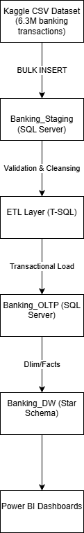

# Banking Analytics Platform

## Overview
This repository contains an end-to-end **Banking Analytics Platform** built using SQL Server and Power BI concepts.  
The project demonstrates how raw financial transaction data can be ingested, validated, modeled, and prepared for analytical reporting using a layered data architecture.

The focus of this project is on **data engineering, OLTP design, data quality enforcement, and analytics readiness**, following patterns commonly used in enterprise environments.

---

## Architecture Overview

The platform follows a layered architecture to ensure scalability, data quality, and separation of concerns:

1. **Data Source**
   - Large-scale CSV dataset representing banking transactions (~6.3 million records)
   - Simulates real-world transactional and fraud-related data

2. **Staging Layer (SQL Server)**
   - Raw data ingestion using `BULK INSERT`
   - Minimal constraints to ensure high-load performance
   - Handles encoding issues and malformed rows
   - Acts as the landing zone for all incoming data

3. **ETL Layer (T-SQL)**
   - Data type validation using `TRY_CONVERT`
   - Business rule enforcement
   - Identification and logging of rejected records
   - Ensures only clean and valid data reaches OLTP

4. **OLTP Layer (SQL Server)**
   - Fully normalized transactional schema
   - Primary and foreign key constraints for referential integrity
   - CHECK constraints for data quality
   - Indexing for performance optimization
   - Separate reject table for audit and troubleshooting

5. **Data Warehouse (Planned)**
   - Star schema design (Fact and Dimension tables)
   - Optimized for analytical queries and reporting

6. **Power BI (Planned)**
   - Fraud analysis dashboards
   - Transaction trends and volume analysis
   - Business-focused reporting using DAX

---

## Database Layers

### Staging Database
Purpose:
- Capture raw transactional data exactly as received
- Support high-volume ingestion
- Preserve source data for reprocessing and auditing

Key Characteristics:
- No strict data types
- No business constraints
- High tolerance for malformed data

---

### OLTP Database
Purpose:
- Store validated and clean transactional data
- Support reliable transactional operations
- Maintain strong data integrity

Key Features:
- Normalized schema
- Surrogate primary keys
- Foreign key relationships
- CHECK constraints (e.g., positive transaction amounts)
- Indexes on frequently queried columns
- Dedicated rejected transactions table

---

## Data Quality Handling
Data quality is enforced at multiple stages:

- Invalid numeric values are filtered using `TRY_CONVERT`
- Transactions with invalid or non-positive amounts are rejected
- Rejected records are stored with rejection reasons and timestamps
- OLTP tables remain clean and consistent at all times

---

## Technologies Used
- Microsoft SQL Server
- T-SQL (DDL, DML, Constraints, Indexing)
- Git & GitHub
- Power BI (planned)
- draw.io (architecture diagram)

---

## Repository Structure
banking-analytics-platform/
│
├── architecture/
│ └── architecture-overview.png
│
├── staging/
│ ├── create_staging_table.sql
│ └── bulk_insert_staging.sql
│
├── oltp/
│ ├── create_tables.sql
│ ├── indexes.sql
│ ├── load_accounts.sql
│ ├── load_transaction_types.sql
│ ├── load_transactions.sql
│ └── rejected_transactions.sql
│
├── dw/ # Planned
├── powerbi/ # Planned
├── maintenance/ # Planned
│
├── docs/
│ ├── assumptions.md
│ ├── data-quality-rules.md
│ └── interview-explanation.md
│
├── data/
│ └── README.md
│
├── .gitignore
└── README.md

---

## Dataset
- Source: Public synthetic banking transaction dataset
- Volume: ~6.3 million rows
- Domain: Financial transactions and fraud detection

> Note: Raw dataset files are intentionally excluded from this repository due to GitHub file size limits.  
> Instructions to obtain and load the dataset are provided in `data/README.md`.

---

## Project Status
- Staging layer: Completed
- OLTP layer: Completed
- Architecture documentation: Completed
- Data Warehouse: Planned
- Power BI dashboards: Planned

---

## Purpose of This Project
This project is designed to demonstrate:
- Real-world data ingestion patterns
- OLTP schema design and constraints
- Data validation and rejection handling
- Enterprise-style data architecture
- Readiness for analytics and BI reporting

